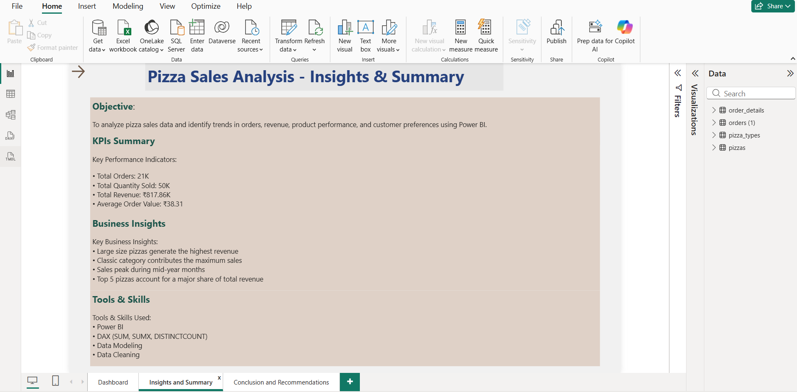
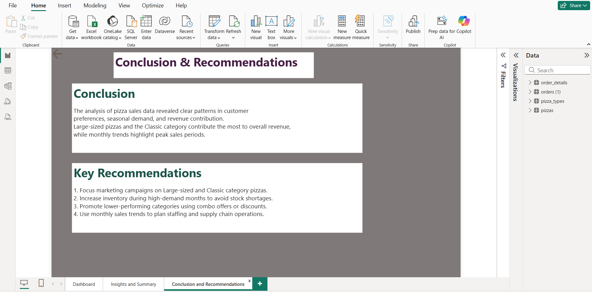

# pizza-sales-analysis
# Pizza Sales Analysis using SQL and Power BI
This project focuses on analyzing pizza sales data to understand overall business performance.

Tools Used:
- SQL for calculating and validating KPIs
- Power BI for building an interactive dashboard

Key KPIs:
- Total Orders
- Total Revenue
- Total Quantity Sold
- Average Order Value

Insights:
- Identified top-selling pizzas and best-performing categories
- Analyzed monthly order trends to understand demand patterns

## 📊 Dashboard

## 🔍 Insights

## ✅ Conclusion

